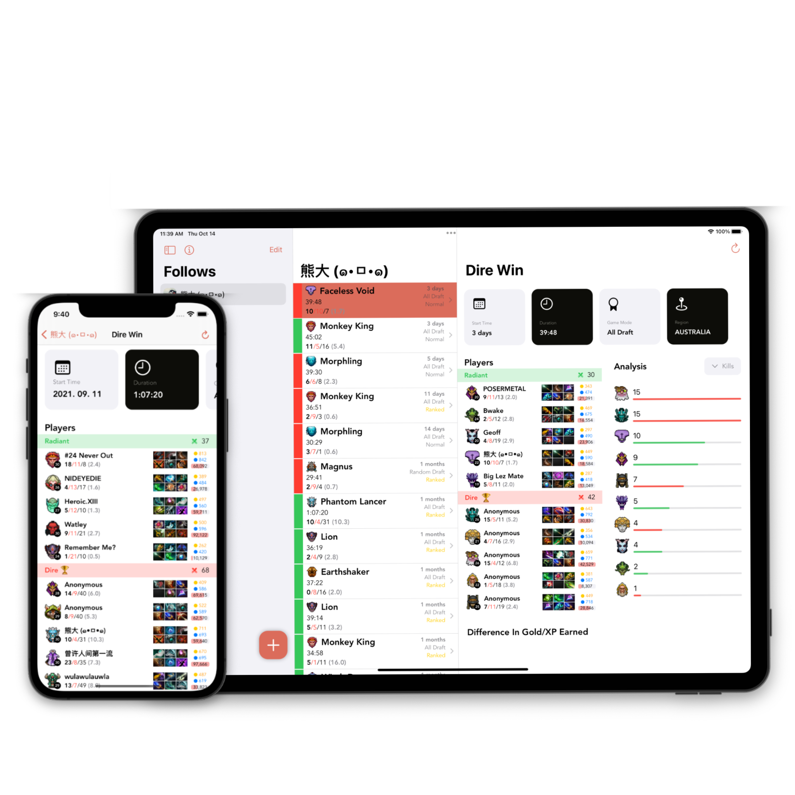

# D2A SwiftUI application!

# Important notes:
* There might be some issue or bugs in the app. You can submit issues on Github. I will try my best to fix it.
* Dota2 Armory is now renamed to D2A!

# Info
* Support Version: 
iOS 15.0+
iPadOS 15.0+

* Xcode Version: 13

# Features
This application is fully written in SwiftUI.
* Follow Dota2 players and check their matches.
* See item builds for each match.
* Support iOS and iPadOS
* Support Widgets
# Whats doing now
* WatchOS app
* MacOS app
* ~~Localization
* Try to build a TvOS app
* Live Match

## Credits
* API is based on [OpenDotaAPI](https://www.opendota.com) and [STRATZ](https://stratz.com/dashboard), thank you!
* All Hero Images are from [Dota2](https://www.dota2.com)
